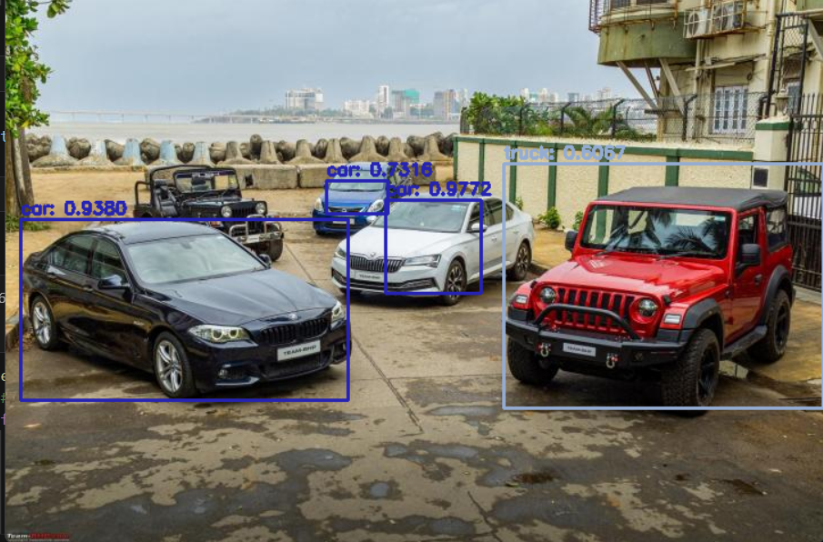

# Object Detection Project using YOLO

This project demonstrates object detection using the YOLO (You Only Look Once) architecture. The YOLO model is a state-of-the-art convolutional neural network for real-time object detection.

## Table of Contents
- [Introduction](#introduction)
- [Features](#features)
- [Results](#results)

## Introduction

This project leverages the YOLO (You Only Look Once) architecture for object detection. YOLO is known for its speed and accuracy in detecting objects in images and videos. It frames object detection as a single regression problem, straight from image pixels to bounding box coordinates and class probabilities.

## Features

- **Real-time Object Detection**: Detect objects in images and videos with high speed and accuracy.
- **Pre-trained Models**: Utilizes pre-trained weights for ease of use and efficient performance.
- **Customizable**: Fine-tune the model on custom datasets for specific applications.

## Results
Input_image:

Output_image

## Methodology

The YOLO (You Only Look Once) architecture is a convolutional neural network (CNN) designed for object detection. The model is trained to predict both the bounding boxes and the class probabilities for these boxes simultaneously.

### Key Steps:

1. **Image Input**: The input image is divided into an \(S \times S\) grid.
2. **Bounding Box Prediction**: For each &#8203;:citation[oaicite:0]{index=0}&#8203;

